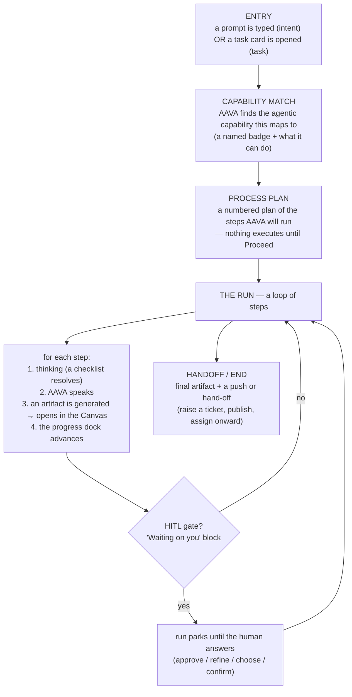

# AAVA Scenario Blueprint

**A framework for defining a new AAVA flow — without touching code.**

Every AAVA scenario, whatever the persona, is built on the *same fixed spine*.
Only the content changes: the capability that gets matched, the plan it runs,
where it pauses for a human, and what it produces. This document turns that spine
into a fill-in-the-blanks blueprint.

**How we use it:** when we want to cover a new user cohort — a QA engineer, a UI
engineer, a UI designer, a data analyst — we send this doc to someone who knows
that job. They describe *their* flow in the blueprint's terms (§5). We take the
filled blueprint and inject it into the app; the fixed spine means there's almost
nothing to invent. The vocabulary in §3 is exactly what AAVA can already render,
so anything expressible here is buildable.

- **§1** — the fixed spine (read this first)
- **§2** — the five zones a scenario plays across
- **§3** — the building blocks you pick from
- **§4** — a worked example (a real scenario, filled in)
- **§5** — the blank template to copy, fill, and send back
- **§6** — appendix: how each field becomes code (AAVA team only)

---

## 1. The fixed spine

A scenario always runs in this order. The author's job is only to fill each stage
with content — never to change the order or invent new stages.

Two things are worth saying plainly, because they are the parts people most often
get wrong:

- **Entry is the *only* thing that differs between "intent-based" and
  "task-based."** After entry, both are identical — capability → plan → run.
  - *Intent-based* = the user starts it by typing (e.g. a PM types
    "show me the analytics after last night's release"). More user-driven.
  - *Task-based* = the work was already assigned/queued and shows as a card the
    user opens (e.g. a developer opens "Add product feedback form"); AAVA has
    often already done some of it and pauses when it needs the human.
- **Nothing runs until Proceed.** The capability card and the plan are shown
  *first*, for the human to accept. This is deliberate and always present.

---

## 2. The five zones

The spine plays out across AAVA's five zones. You don't design the zones — they're
fixed — but knowing where each thing lands helps you describe a step.

| Zone | What it holds during a scenario |
|---|---|
| **Sidebar** | Navigation, recents, the profile. Not scenario content. |
| **Conversation** | The turns: AAVA's messages, the thinking accordions, the capability card, the plan, the artifact cards, and the **HITL "Waiting on you" blocks**. The **task-progress dock** hangs under this zone's header. |
| **Canvas** (right panel) | The **artifact** itself — a document (`.md`) or a dashboard view. Also hosts the **execution-activity topology** (opened from the header) and the **session files** list. |
| **Toolbar** | The view switcher for whatever the Canvas is holding. |
| **Watch** | An append-only **run log** docked under the Canvas — every "Reading PRD…", "7 epics drafted", "Ticket created" line. |

So a single step typically writes to three zones at once: the Conversation (the
message + accordion), the Canvas (the artifact), and Watch (the log line), while
the progress dock ticks forward.

---

## 3. The building blocks

These are the only pieces a scenario is made of. Each maps to something AAVA can
already render, so if you can describe your flow with these, it's buildable.

### 3.1 Entry — pick one

| Type | When to use | What you specify |
|---|---|---|
| **Intent** | The user kicks it off by typing. | The trigger phrase(s) they'd type, and the words that identify the intent (e.g. "analytics", "after the release"). |
| **Task** | The work is assigned and waits as a card. | The card title, its status ("Ready for review" / "Needs your input" / "Blocked"), and the one-line note on it. |

### 3.2 Capability match

The first thing AAVA does. A short "matching a capability" shimmer, then a card
that names the capability.

You specify:
- **Capability name** — e.g. *Epics & Feature Generator*, *Product Analytics & Feedback Triage*.
- **Badge** — a short code, e.g. `EFG-1.0`, `PAT-1.0`, `USG-1.0`.
- **Maps-to line** — "This maps to the '…' agentic process. I can take it end-to-end:"
- **Capability chips** — 3–5 short phrases of what it does (e.g. "PRD parsing", "Backlog decomposition", "Definition-of-Ready checks").

### 3.3 Process plan

A numbered plan, shown before anything executes, with a **Proceed** button.

You specify:
- **Plan title** — usually the capability's name.
- **The steps** — 3–6 of them, each a short title + one line of detail. These
  become the **task-progress dock** the user watches tick forward.

### 3.4 A run step

The repeating unit. Each step has up to four parts (all optional except a message
or an artifact):

1. **Thinking** — a checklist of sub-tasks that resolve one-by-one (spinner → ✓),
   folding into a titled accordion when done. e.g. *"Clustering 28 requirements",
   "Drafting Epic 1", … "Applying epic template → 7 epics"*. Use it to show work.
   *(If the work was done before the user arrived — a task-based flow — the
   accordion can render already-complete, with no fake loading.)*
2. **Message** — what AAVA says (1–3 short paragraphs). Plain language.
3. **Artifact** — the thing produced this step (see §3.6). Lands as a card in the
   Conversation and opens in the Canvas.
4. **Gate** — if the step needs the human, it ends in a HITL block (see §3.5).

> **Ordering rule — always keep this order in every scenario.** The parts appear
> in the sequence above: the **explanation of the finding comes first**, then the
> **artifact card (with its Open button)**, then the **next probing question or
> gate**. The artifact sits *between* the explanation and the question — never
> before the explanation. In code this means: emit the explanation `say`, then the
> artifact reveal, then the `say` that carries the gate/next question (its lead-in
> line, if any, streams above the card once answered). Do **not** fold the
> explanation into the same `say` as the gate with the artifact revealed ahead of
> both — that puts the card above the text the user needs to read first.
>
> *Correct:* `say(finding…)` → `artifact(report.pdf)` → `say(question, gate)`.
> *Wrong:* `artifact(report.pdf)` → `say(finding… + question, gate)`.

### 3.5 HITL gates — the "Waiting on you" blocks

The heart of the flow. A gate **parks the run** until the human answers. Pick the
gate *type* that fits the decision. These are the exact types AAVA renders:

| Gate type | Looks like | Use it when the human must… | You specify |
|---|---|---|---|
| **buttons** | A titled card with 2 pill buttons (a primary + a secondary), optional summary line. | …approve or send it back (the default review gate). | Title, question, the two button labels, and where each leads. A button can instead **open a text box** ("collect") if the answer is free-text (e.g. "Add the missing info"). |
| **action** | A titled card with one primary action + an icon. | …grant one obvious thing (access, "start execution"). | Title, the single action label. |
| **clarify** | A lettered multiple-choice panel + an "Other…" free-text row + Continue. | …pick from options (or type their own). | Title, the choices, a counter ("1 of 3"). |
| **confirm** | A card listing concrete rows (e.g. repo → branch, what changes) + Accept / Cancel. | …confirm a specific, itemised action (e.g. "raise both PRs"). | The rows to show, accept + cancel labels. |
| **sync** | A "push to Jira" card — a primary ("Publish"/"Raise ticket") + a "Skip". | …decide whether to push this level to a tracker now or later. | Title, detail line, primary label, and that Skip continues without pushing. |
| **connect** | A connector card — searches, offers Connect, then connecting/connected. | …wire up an integration that isn't connected yet. | The service name. |

For each gate, tell us: **what it asks**, **the options**, and **what each option
leads to** (usually: primary → next step; secondary → a refine loop or skip).

> **How many gates?** As many as the flow genuinely needs a human. A review-heavy
> flow (backlog) pauses after every level; an investigation (analytics) pauses
> lightly and lets the user drive via a suggested next prompt. State your gates
> explicitly — one per real decision.

### 3.6 Artifacts & Canvas views

What each step produces. Two shapes:

| Artifact shape | Renders as | Example |
|---|---|---|
| **Document** | A `name.md` card in the chat; opens as a formatted document in the Canvas (Preview / Code, comment, download). | `intake.md`, `epics.md`, `PRD-2026-084.md` |
| **Dashboard view** | A `name.view` card; opens as a rich panel in the Canvas (KPIs, tables, charts, logs). | a funnel + KPI grid, a log-audit timeline |

Under the **task-progress dock**, each produced artifact shows as the phase's doc,
and clicking a dock step reopens that artifact. Name each artifact and say which
shape it is.

### 3.7 Watch log & topology

- **Watch** — for each step, a couple of short log lines ("Reading PRD…",
  "7 epics drafted"). Append-only. Optional but nice; give a line or two per step.
- **Execution-activity topology** — opened from the Canvas header; shows the
  agentic process as a graph. It's derived automatically from your plan + steps,
  so you don't design it — just know it exists.

### 3.8 Handoff / end

How the scenario finishes. Usually the final artifact plus one of:
- a **push** to a tracker (raise a Jira ticket, publish the backlog) — a `sync`
  gate whose success shows links;
- a **hand-off** ("sprint planning goes to the scrum master", "engineering picks
  it up") — a closing message;
- simply **done**, with the artifact left open to edit.

---

## 4. Worked example — "PRD → Stories" (PM), filled in

A real, shipped scenario expressed in the blueprint. Use it as your model.

- **Persona / cohort:** Product Manager (Raman)
- **Entry:** *Intent* — the PM types *"here is our PRD, create the epics and user stories."* (Also available task-based, as a seeded "PRD to Stories" card.)
- **Capability:** *Epics & Feature Generator* · badge `EFG-1.0`
  - Maps-to: "the 'Epics and Features Generator' agentic process. I can take it end-to-end:"
  - Chips: PRD parsing & requirement extraction · Backlog decomposition (epics → features → stories) · Definition-of-Ready checks · Sprint planning & story mapping
- **Plan (4 dock steps + a publish):** Intake & understanding · Draft epics · Break into features · Write user stories · (Publish to Jira)
- **The run:**

| # | Thinking (accordion) | AAVA says | Artifact | Gate |
|---|---|---|---|---|
| 1 | Reading PRD → parsing → extracting objectives/roles/requirements → intake summary ready | "PRD received — 5 objectives, 6 roles, 28 requirements… here's what I understood." | `intake.md` (document) | **buttons** — *"Confirm the intake summary. Does this match your PRD?"* → **Yes** = draft epics · **No** = refine loop |
| 2 | Clustering 28 requirements → drafting Epic 1…7 → applying template | "7 epics drafted, each on the same template…" | `epics.md` (document) | **buttons** — *"Are these 7 epics right?"* → **Yes** → then a **sync** offer: push 7 epics to Jira, or skip |
| 3 | Decomposing each epic → checking required fields (3 gaps found) | "23 features across the 7 epics. Three are missing target dates & priority…" | `features.md` (document, gaps highlighted) | **buttons + collect** — *"Fill the missing fields?"* → **Add the missing info** (opens a text box) · **Proceed without** |
| 4 | Decomposing 23 features → writing acceptance criteria → applying story template | "58 stories confirmed. Want me to push them to Jira?" | `stories.md` (document) | **sync** — *"Push the 58 stories to Jira"* → Publish · Skip |

- **Watch lines:** "Reading PRD · WireFrame Studio v1.0" → "Intake summary ready" → "7 epics drafted" → "23 features · 3 missing fields" → "58 stories drafted" → "58 stories created · Jira".
- **Handoff / end:** stories published to Jira with parent–child links; **sprint planning is handed to the scrum master.** No further action on the PM.

---

## 5. The blank blueprint — copy, fill, send back

> Copy everything between the lines, fill every field in plain language, and send
> it back. Leave a field blank only if it genuinely doesn't apply. You do **not**
> need to know how AAVA is built — just describe your flow.

---

### Scenario blueprint: `<short name>`

**1. Persona / cohort** — *who is this for?* (e.g. QA engineer, UI designer)

**2. One-line goal** — *what does the user get at the end?*

**3. Entry** — pick one:
- [ ] **Intent** — the user types something. What would they type?
  `___`
- [ ] **Task** — it's assigned as a card. Card title / status / one-line note:
  `___`

**4. Capability match**
- Capability name: `___`
- Badge (short code): `___`
- "This maps to the '`___`' agentic process. I can take it end-to-end:"
- Capability chips (3–5): `___`

**5. Process plan** — the 3–6 steps AAVA will run (each: a title + one line):
1. `___`
2. `___`
3. `___`
4. `___`

**6. The run — one block per step.** Copy this block per plan step:

> **Step N — `<title>`**
> - **Thinking** (the checklist that resolves; or "already done" if pre-computed):
>   `___`
> - **AAVA says:** `___`
> - **Artifact produced:** name + shape (document `.md` / dashboard view / none):
>   `___`
> - **Gate here?** (yes/no). If yes:
>   - Type (buttons / action / clarify / confirm / sync / connect): `___`
>   - What it asks (the "Waiting on you" question): `___`
>   - Options and where each leads: `___`
> - **Watch line(s):** `___`

**7. Handoff / end** — how it finishes (push to a tracker / hand off to whom / just done):
`___`

**8. Anything special** — edge cases, a refine loop, a "connect first" step, a
follow-up the user might ask mid-flow:
`___`

---

## 6. Appendix — how a filled blueprint becomes code (AAVA team)

Each blueprint field has a direct home in the codebase. Nothing here is invented;
these are the constructs the shipped scenarios already use (`src/prd/*Flow.ts`,
`src/scenarios/*.ts`, `src/state/types.ts`).

| Blueprint field | Code construct |
|---|---|
| **Entry · intent** | An `isXxxIntent(text)` detector in `prd/data.ts`, routed in `useJourney.send()` to `dispatch(OPEN_OBJECT, { kind })` + play the opening beats. |
| **Entry · task** | A seeded `Task` card (`reducer.ts`) + `opening` lines, or a full `Scenario` with `prep` steps (`scenarios/*.ts`). |
| **Capability match** | An opening `Effect[]` with `{ type:'say', block:{ kind:'capability', badge, maps, chips, searching:true } }` → `{ type:'capabilityMatched' }`. |
| **Process plan** | `{ kind:'plan', count, title, steps:[{title,detail}], action:{ label:'Proceed', beat } }`. |
| **Plan → dock** | `PROGRESS_STEPS: PrepStep[]` + a `xxxProgress(messages)` selector feeding `RunStrip`. |
| **Thinking accordion** | `{ type:'tools', title, steps:[{label,result,ms}] }` (ms:0 = already-complete). |
| **Message** | `{ type:'say', lines:[…] }`. |
| **Artifact · document** | `{ kind:'document', name, format:'MD', doc }` + a `{ type:'setDoc', doc }`; content in `prd/backlog.ts` / `document.ts`. |
| **Artifact · dashboard** | `{ kind:'document', name, insight }` + `{ type:'setInsight', view }`; content + `InsightCanvas`. |
| **Gate · buttons** | `{ kind:'decision', variant:'buttons', step, title, question, options:[{label,beat,primary,collect}], summary }`. |
| **Gate · action / clarify / approve** | same `decision` block, `variant` set accordingly (`icon`, `counter`, `placeholder`). |
| **Gate · confirm** | `{ kind:'confirm', rows, acceptLabel, cancelLabel, acceptBeat, step, title }`. |
| **Gate · sync (push)** | `{ kind:'sync', title, detail, beat, primaryLabel?, secondaryLabel:'Skip', secondaryBeat }`. |
| **Gate · connect** | `{ kind:'connect', service, detail, beat, state }` + `{ type:'connectState', state }`. |
| **Each option → next step** | the option's `beat` names an entry in the flow's `BEATS: Record<string, Effect[]>`; `withGate()` re-appends the parked gate after reading turns. |
| **Watch lines** | `{ type:'watch', text, tone:'info'|'ok'|'warn' }`. |
| **Topology** | derived from plan + steps by `AgentGraph`; opened via the "execution activity" header toggle. No authoring needed. |
| **Handoff · push** | the `sync` success beat → `watch` created + `{ kind:'links', links:[…] }`. |

**Injection checklist for a new scenario:**
1. Add the intent detector (or seed the task card).
2. Write the `xxxOpening()` — capability card + plan + Proceed beat.
3. Define `PROGRESS_STEPS` + the progress selector.
4. Write the `BEATS` map — one entry per plan step and per gate branch.
5. Author the artifact content (documents or a dashboard view + its Canvas renderer).
6. Wire the object kind through `types.ts`, `reducer.ts`, `useJourney.ts`, `App.tsx` (mirror `backlog` / `insight`).
7. Add a `*.test.ts` asserting the plan, the progress advance, and each gate's routing.

---

*This blueprint mirrors the shipped flows: the PRD→backlog run (`prd/backlogFlow.ts`),
the Product-Analytics run (`prd/insightFlow.ts`), and the developer task flows
(`scenarios/t1.ts`, `t7.ts`). Keep it in sync with those if the spine ever changes.*
